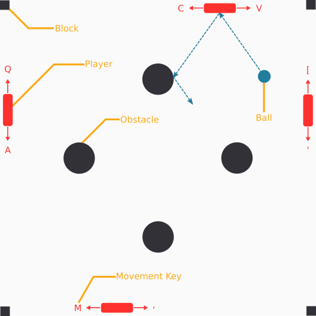
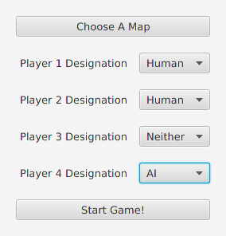

* Collaborators
  1. Samantha Anderson
  2. Ethan Lam
  3. An Nguyen

# Functional Specification

We will be creating a game that takes inspiration from Pong. Our game will support 1-4 players as opposed to just 2 players seen in the original game. In the game, each player will occupy their own side of the "board". Each player will be a rectangle that can either move vertically or horizontally depending if the player is on the left/right sides of the board or the top/bottom sides of the board. A ball represented as a circle, as opposed to a square, will bounce around the board and on the player's paddle, and the objective is to keep the ball in the play area. Each player is initially assigned 11 lives. When the ball moves past the wall behind a player, because the player fails to bounce the ball back, that player is deducted a life. Players are eliminated from the game the moment they reach 0 lives, and the last player standing is determined as the winner. When a player loses a life, the players have their locations reset back to their respective side's center. When a life is deducted the current scoreboard will flash on the screen, and when a winner is determined, the game will terminate. 

So that the game has variety and is not completely predictable, the ball at the start of the game will start in the middle of the board. It will then be thrown in a random direction, and every time the ball collides with a player's paddle, the ball will reflect off the paddle's surface with a slight deviation from the true reflection in the sense that the angle of reflection will be slightly perturbed from the true angle of reflection. Additionally, players will have the option to choose between different maps which form different configurations of the board by adding various obstacles throughout the course. When the ball collides with these obstacles, it will reflect off the surface, and having multiple obstacles throughout the board will cause the ball to follow a somewhat chaotic trajectory. 

The game will come in 2 forms: local play and networked play. In local play, players will play the game on the same computer using the same keyboard. The following keys will be used to control the players: `Q A`, `[ '`, `C V`, and `M ,`. The positions of these keys on a US QWERTY keyboard suggests what direction the paddles will move in. In networked play, players play on separate computers which communicate over a network such as the internet or university WIFI network. In networked mode, players will use the arrow keys to move their character in the obvious fashion. 

To create a game for both local and networked play, a configuration menu will be presented. In this menu players have the option to choose what map they want to play on and how players should be designated. There are 4 players available and each player can either be a human player, an AI player, or neither. If a player is designated as a human player, that player will be controlled via the keyboard using the above scheme. If the player is designated as an AI player, the computer will take over the paddle and play the game in place of a human. Otherwise, players designated as neither human nor AI will have a wall as a placeholder. One could imagine for example a matrix encoding some player designation as such

|    | Human | AI | None |
|--- | ----- | --- | ---- |
| Left |X|-|-|
| Right |X|-|-|
| Top |-|-|X|
| Bottom |-|X|-|

We will impose the condition that at least 1 player must be human so that the game can terminate.

A potential user interface for the configuration menu may look like the image below.

How the board is configure will depend on the player designations made. If no player (human or AI) occupies a side, a wall is placed. Additionally if two human/AI players are adjacent to each other on the board, a "block" obstacle will be placed in the corner that both sides share to prevent player-player collisions. This block also prevents the ball from passing into both players' sides causing an indeterminate life deduction. 

The AI player will play in such a fashion that it can never lose. Depending on its position, the action policy is to move up [resp. right] whenever the ball is above [resp. right of] its paddle's center and move down [resp. left] otherwise. The purpose of the AI player is to act as a sort of "trainer" for human players, and the fact that the AI player is a paddle will cause the ball to have unpredictable behavior upon collision and reflection. 

One of the main challenges of the game will be to have a networked game. In a networked game, there are two parties: the server and the clients. The server will hold a local copy of the game that is updated in response to the clients' inputs. The clients will be players who participate and observe the game. The clients will receive periodic updates from the server with respect to the current state of the game which clients use to inform their decision making. The challenging aspect of the networked game is that the server will broadcast and update to the clients every 16ms which leads to a smooth 60fps (frames per seconds) game play which is essentially for a game based on reaction time. Thus the server needs to broadcast the game in realtime with little to no delays in transmission with clients needing to progress the game in the absence of server updates.

# Technical Discussion of Technology and Architecture Used

In a networked game, the server will generate a local game using a similar configuration style as mentioned above. Additionally, the server will need to bind to a network address, typically an IP address, and expose two ports over the network. The combination of address and port forms a communication link that clients can use to communicate with the server. The server will expose one port for the TCP protocol and the other port for the UDP protocol. The TCP protocol will facilitate communication involving critical information such as the map being played, who are the connected players, the current score, etc. The UDP protocol will facilitate communication involving non-critical information that have the possibility of not being delivered properly such as the current positions of all the players and ball. The UDP protocol will allow for realtime game updates. Clients connect by inputting the server's address, the server's TCP port and the server's UDP port, all of which are necessarily to establish communication. 

We will build a rudimentary game engine in Java with rendering handle by JavaFX to allow for a less brittle implementation of the game. The game engine will consist of not only displaying the game but also handling complex game dynamics through the creation of a physics engine. The physics engine portion of the game engine will allow us to create a highly extendable game as it lays a foundation for principled interactions between objects. The physics engine will be responsible for handling collision detection and triggering subsequence actions in response to collisions. Support for collisions between circles and rectangles (not necessarily axis-aligned) will be guaranteed by the physics engine. More complex shapes are handled by merging these primitive shapes.

To achieve a networked game, we will also build a custom network protocol, and we will use a popular networking library called Netty to aid in this development. Netty exposes Java's NIO framework in an easier to use, less error prone interface. Netty allows development to be focused on the network protocol while not getting bogged down with handling raw byte streams and maintaining network sockets which not only obscures the development process but is also highly error prone by forcing the programmer to work at a very low level. We will use an asynchronous, event-driven, non-blocking architecture provided by Netty whereby the server can handle network events asynchronously in realtime with high performance by responding to network events the moment they come without blocking execution in an attempt to consume non-yet-occurred network events. In Netty, an event loop is generated whereby a loop runs until the teardown of the server checking for network events. Once network events occur, the event loop dispatches the event to the correct handler for processing which could for example involve updating the game state.  