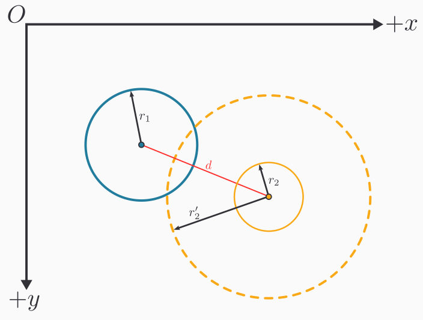
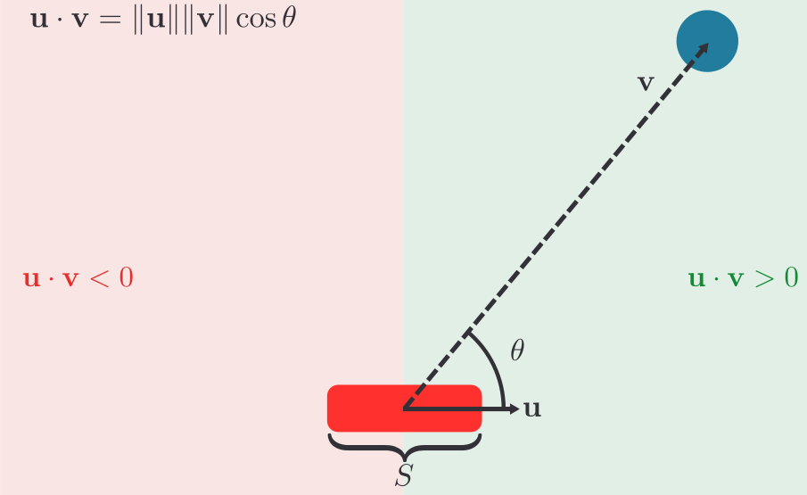
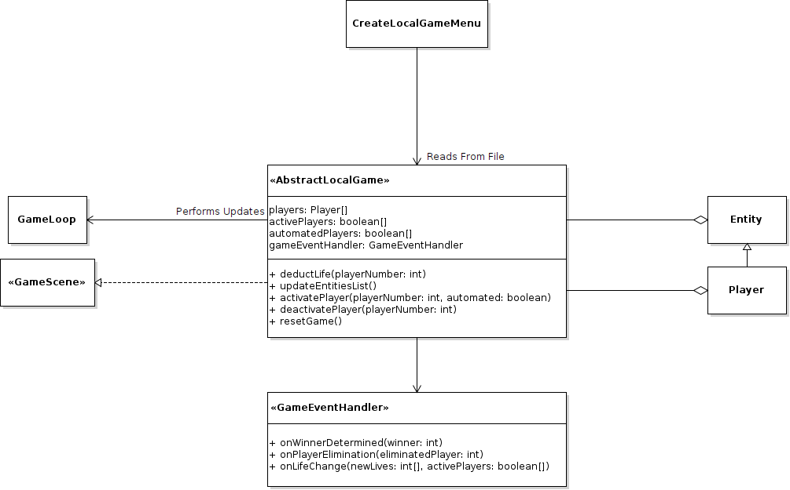
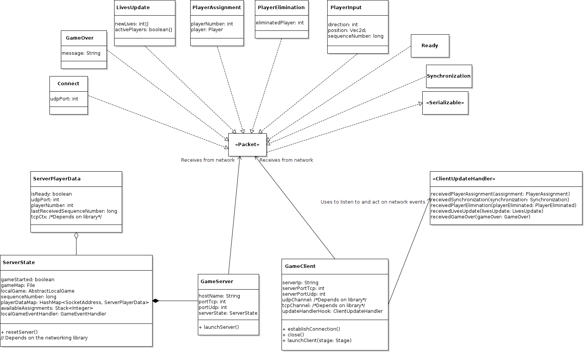
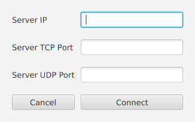

* Collaborators
  1. Samantha Anderson
  2. Ethan Lam
  3. An Nguyen

# Design
## The Game Loop
Because our game is an interactive program that updates in real time, we will need a sort of abstraction that handles updating the game in real time while also receiving user input. It achieve this goal we will introduce the idea of a **game loop**. At a high level a game loop will involve the following steps

1. Respond to user input
2. Update the game state
3. Render the game state
4. Go to step 1.

where the "game state" is any sort of abstract representation of the game in the moment. The game state could for example involve the positions and velocities of the players and ball. 

When the game responds to user input, it could for example update the velocities of the players. During the update phase, the game could then move all the players and ball in the direction of their velocity or update them in accordance with physical laws. Finally, with the updated state, the game is rendered to the screen, and the process starts over. This overview forms the basis of an interactive video game.

With the game loop covered at a high level, we will make an interface called `GameScene` that captures each stage of the game loop so that it can inevitably be driven by a sort of looping construction. In the `GameScene`, there will be methods that handle keyboard events as follow
```java
/**
 * The method called when it is detected that a key on the keyboard 
 * has been depressed
 * @param e a description of the keystroke that occurred
 */
void onKeyPressed(KeyEvent e);
/**
 * The method called when it is detected that a key on the keyboard 
 * has been released
 * @param e a description of the keystroke that occurred
 */
void onKeyReleased(KeyEvent e);
```
The `KeyEvent` object is from `javafx.scene.input.KeyEvent`, and it is no coincidence that the method signatures matches that of JavaFX's key event listeners. Whenever JavaFX detects a key press, we will pass that key event to these methods for the game scenes implementing `GameScene` to handle. Implementing these methods allow for custom game logic to execute in response to keyboard events.

Next, any game scene implementing `GameScene` needs to specify how the game state should be updated. Thus we will include the following method in the interface 
```java
/**
 * The method called to progress the game state
 * @param currentTime the time in nanoseconds relative to an arbitrary 
 * start time.
 */ 
void updateState(long currentTime);
```
This method will be called by the game loop to advance the game state which typically involves updating the position of game objects. We need to to pass in a `currentTime: long` to decouple the game updates from the computer hardware's power. Consider two computers with two different CPUs. On the faster CPU the game loop will execute at a higher frequency than the slower computer which means the faster CPU will update the game more often. If implemented without care, the game may run at a higher speed on the faster computer giving an inconsistent experience across different hardwares. To remedy this issue, every time the game is updated, the time in nanoseconds must be supplied so that the game can determine the proper way to update the state so that the game state is tied to time that has passed and not hardware power. Thus even if one were to play the game on different computers, the experience will feel relatively similar as one's experience with time does not often change. 

Finally the `GameScene` needs a way to render the scene which means the following method must implemented
```java
/**
 * The method called to render the game scene to a canvas
 * @param canvas the canvas to draw the scene on
 */ 
void render(Canvas canvas);
```
The `Canvas` object is from `javafx.scene.canvas.Canvas` and any sort of custom render code for the `GameScene` should perform all draw operations on this `Canvas`.

Finally, as a convenience method `GameScene` should have a default method called `generateRenderableComponent(int, int) -> Canvas`. This method essentially creates a `Canvas` object for us and configures it to handle keyboard inputs. It will take two integers which parametrizes the returned `Canvas`'s width and height, respectively. A `Canvas` will first be created and its key pressed handler will be attached to the `onKeyPressed` method in `GameScene`. Similarly, the key released handler will be attached to the `onKeyReleased` method in `GameScene`. Thus all keyboard events on the `Canvas` will be dispatched to class implementing `GameScene`. However in the current state, the `Canvas` will not accept keyboard inputs as it is not "focused." The `Canvas` can received keyboard inputs by notifying JavaFX that the `Canvas` can be "focused" on. Then we just request the focus be on the `Canvas` and return the `Canvas` object. In code the method would resemble
```java
/**
 * Creates a Canvas object configured to be compatible with the GameScene
 * interface
 * @param width the Canvas's width in pixels
 * @param height the Canvas's height in pixels
 */
default Canvas generateRenderableComponent(int width, int height) {
    Canvas canvas = new Canvas(width, height);
    canvas.setOnKeyPressed(this::onKeyPressed);
    canvas.setOnKeyReleased(this::onKeyReleased);
    canvas.setFocusTraversable(true);
    canvas.requestFocus(true);
    return canvas;
}
```
Finally, `GameScene` should extend `Serializable`. We will impose this constraint so that later in the development of the game, we have the capability of saving game scenes on the drive and even transmit game scenes over the network.

In whole the interface should look as such
```java
public interface GameScene extends Serializable {
    void updateState(long currentTime);
    void onKeyPressed(KeyEvent e);
    void onKeyReleased(KeyEvent e);
    void render(Canvas canvas);

    default Canvas generateRenderableComponent(int width, int height) {
        Canvas canvas = new Canvas(width, height);
        canvas.setOnKeyPressed(this::onKeyPressed);
        canvas.setOnKeyReleased(this::onKeyReleased);
        canvas.setFocusTraversable(true);
        canvas.requestFocus();

        return canvas;
    }
}
```
The `GameScene` sets the foundation for the different phases a game goes through. We now need to drive it with a looping construct. Rather than use a naive `while` loop, we will make use of the `AnimationTimer` in JavaFX so as to not lock up the main thread of our program with the game loop. We will make a class called `GameLoop` which extends `AnimationTimer`. In order to extend `AnimationTimer` the class must override the `handle` method which is called every time the `AnimationTimer` "ticks" which occurs at a fairly high frequency. First, however, the class `GameLoop` has two fields: a `gameScene: GameScene` and a `canvas: Canvas`. The `GameScene` informs the `GameLoop` what scene it needs to drive, and the `Canvas` informs the `GameLoop` where the rendering should take place. The canonical constructor should be used to fill these fields. As for the `handle` from `AnimationTimer`, we simply need to call `updateState` and then `render` on `gameScene` every time the `AnimationTimer` pulses/ticks. In code the `handle` function would resemble
```java
public class GameLoop extends AnimationTimer {
    private GameScene gameScene;
    private Canvas canvas;
    // --snip--

    /**
    * The method called periodically by AnimationTimer
    * @param now the time in nanoseconds
    */
    public void handle(long now) {
        gameScene.updateState(now);
        gameScene.render(canvas);
    }
}
```
Now, whenever we would like to render a `GameScene`, we simply instantiate an instance of some `GameScene`, create a `Canvas` from it using `generateRenderableComponent`, pass both objects into the `GameLoop`, and run the `start` method on the `AnimationTimer` which `GameLoop` inherits.

The work up to this point is represented diagrammatically below.


## The Physics Engine
To make computation easier we will develop a helper class called `Vec2d`. This class represents 2 dimensional vectors and has methods that can execute common vector operations. In this class there are 2 fields, both of which are doubles: `x` and `y`. For brevity assume that the canonical constructor is used and setters and getters for `x` and `y` are implemented. Mathematically, an instance of `Vec2d` will encode the vector $\left\langle x, y \right\rangle$. This class should also implement `Serializable`.

First, we will define a method `scale` which takes a `double` `c` and returns a new vector that is a scaled version of the current vector. To do this, we simply multiply each component of the vector by `c`.
```java
/**
 * Scales a vector by a constant multiple
 * @param c the constant multiple
 * @return a scaled vector
 */
public Vec2d scale(double c) {
    return new Vec2d(x*c, y*c);
}
```
We will also define a method `add` which adds two vectors and returns the result. It takes a `Vec2d` called `other`, and adds `this` with `other`, component-wise.
```java
/**
 * Adds the current vector the another vector
 * @param other the vector to add with
 * @return the vector sum
 */
public Vec2d add(Vec2d other) {
    return new Vec2d(
        this.x + other.x, this.y + other.y
    );
}
```
Similarly subtraction is defined but the method is called `sub` and the components are subtracted as opposed to added.
```java
/**
 * Computes the difference between the current vector with another vector
 * @param other the vector to subtract with
 * @return the vector difference
 */
public Vec2d sub(Vec2d other) {
    return new Vec2d(
            this.x - other.x, this.y - other.y
    );
}
```
It will also be convenient to compute dot products, so we will also create a method `dot` that takes a `Vec2d` called `other` and returns a `double`. Given two vectors $\left\langle x, y \right\rangle$ and $\left\langle x', y' \right\rangle$ the dot product is $x \cdot x' + y \cdot y'$.
```java
/**
  * Computes the dot product between the current vector and another vector
  * @param other the other vector
  * @return the dot product
  */
public double dot(Vec2d other) {
    return this.x * other.x + this.y * other.y;
}
```
The method `mag` should simply return a `double` representing the magnitude or length of the current vector. From linear algebra the magnitude of vector $\mathbf{v}$ is $\sqrt{\mathbf{v} \cdot \mathbf{v}}$ which conveniently can be implementing using `dot`.
```java
/**
 * Computes the length of the current vector
 * @return the length of the vector
 */
public double mag() {
    return Math.sqrt(this.dot(this));
}
```
We will also implement a method `projectOnto` which takes another `Vec2d` and returns a `Vec2d` representing the projection. Thus `a.projectOnto(b)` in mathematical notation would be $\text{proj}_\mathbf{b}\mathbf{a}$. Using linear algebra, this can be computed with 

$$
    \text{proj}_{\mathbf{b}}\mathbf{a} = \left(\mathbf{a} \cdot \frac{\mathbf{b}}{\lVert \mathbf{b} \rVert}\right) \mathbf{b}
$$
```java
/**
 * Computes the projection of the current vector onto another vector
 * @param other the vector to project onto
 * @return the projection vector
 */
public Vec2d projectOnto(Vec2d other) {
    Vec2d unit = other.normalize();
    return unit.scale(unit.dot(this));
}
```
Finally, the last method to be implemented is `rotate` which takes a `double` called `angle` in radians. It returns a `Vec2d` that is the rotation of the current vector, rotated about the origin by `angle`. This action can be done using a rotation matrix

$$
\begin{bmatrix}
\cos \theta & -\sin \theta \\\\  
\sin \theta & \cos \theta 
\end{bmatrix} 
\begin{bmatrix} x \\\\ y \end{bmatrix}
\\ = \\ 
\begin{bmatrix} 
x\cos\theta-y\sin\theta \\\\
x\sin\theta+y\cos\theta
\end{bmatrix}.
$$

For more information see [https://en.wikipedia.org/wiki/Rotation_matrix](https://en.wikipedia.org/wiki/Rotation_matrix) which is where the above formula came from.
```java
/**
 * Rotates the current vector about the origin
 * @param angle the angle to rotate by in radians
 * @return a rotated vector
 */
public Vec2d rotate(double angle) {
    double c = Math.cos(angle);
    double s = Math.sin(angle);
    return new Vec2d(x*c - y*s, x*s + y*c);
}
```
Now with two dimensional vectors implemented, we will use mathematical notation for vectors when convenient with the understanding that they can easily converted into an instance of `Vec2d`.

To detect collisions between different types of shapes, we will make an interface `Collider` with the following form.
```java
public interface Collider extends Serializable {
    /**
     * Determines whether two Colliders intersect each other
     * @param other the other collider with which to check for an 
     * intersection
     * @return a boolean that determines if the current Collider intersects 
     * with other
     */
    boolean collide(Collider other);
    /**
     * Gets the position of the Collider
     * @return the position of the Collider
     */
    Vec2d getPosition();
    /**
     * Sets the position of the Collider
     * @param position the new location of the Collider
     */
    void setPosition(Vec2d position);
}
```
The interface should extend `Serialiable` so that it can be converted into bytes for storage and transmission.

Notice that we are making use of `Vec2d` to describe a physical property like position. In any event, the method of particular interest is `collide` which every class implementing `Collider` must create. This method is used to check collision between two `Collider` objects.

The first `Collider` we will create will be a `RectangleCollider`. A `RectangleCollider` is defined by the position of its top-left corner which we will call the `origin: Vec2d`. The collider is also defined by the following doubles: `width`, `height`, and `angle`. Note that `angle` should be in radians and it describes how much the rectangle is rotated about its origin. See the figure below for an illustration. In the image $(x, y)$ is `origin` and $\theta$ is `angle`.


The canonical construction should be made, and setters and getters for the attributes should be made. For `setPosition` and `getPosition` from `Collider`, the `origin` should be taken as the `RectangleCollider`'s position.

The `RectangleCollider` class should also have a helper method `computeVerticesAndBasis` which returns an array of `Vec2d`s. The returned array will be composed of 6 `Vec2d`s. The 4 vertices of the rectangle, starting at the `origin` and moving clockwise, will be the first 4 entries and the last 2 entries will be "basis" vectors of the rectangle. See the figure below to visualize the basis vectors which in essence form a local coordinate system on the rectangle relative to `origin`. The basis vectors in the figure are $\mathbf{b}_1$ and $\mathbf{b}_2$, and note that for convenience purposes these vector will have unit length.


We can easily compute the 6 values using basic linear algebra. Let

$$
\mathbf{u} = \left\langle \text{width}, 0 \right\rangle 
$$

and 

$$
\mathbf{v} = \left\langle 0, \text{height} \right\rangle.
$$
As of now these two vectors form the axis-aligned version of the rectangle. To get the rotated version, we should rotate both of these vectors by `angle` using the `rotate` method in `Vec2d`. We will now denote the rotated version of $\mathbf{u}$ and $\mathbf{v}$ as $\mathbf{u}'$ and $\mathbf{v}'$ respectively. We can now form the array.

$$
\begin{bmatrix}
    \mathtt{origin} \\\\
    \mathtt{origin} + \mathbf{u}' \\\\
    \mathtt{origin} + \mathbf{u}' + \mathbf{v}' \\\\
    \mathtt{origin} + \mathbf{v}' \\\\
    \mathbf{u}'\mathtt{.normalize()} \\\\
    \mathbf{v}'\mathtt{.normalize()} \\\\
\end{bmatrix}
$$

The code would resemble 
```java
/**
 * Computes the vertices of the rotated rectangle along and also returns 
 * the local coordinate space
 * @return a list of vectors where the first 4 vectors are the vertices 
 * and the last two are the basis vectors of the local coordinate space
 */
public Vec2d[] computeVerticesAndBasis() {
    Vec2d b1 = new Vec2d(width, 0).rotate(angle);
    Vec2d b2 = new Vec2d(0, height).rotate(angle);
    Vec2d sum = b1.add(b2);

    return new Vec2d[] {
            origin,
            origin.add(b1),
            origin.add(sum),
            origin.add(b2),
            b1.normalize(),
            b2.normalize()
    };
}
```
Before we implement `collide` from `Collider` for `RectangleCollider`, we should introduce another collider: `CircleCollider`. A `CircleCollider` is parameterized by the following fields: `center: Vec2d` and `radius: double`. Both of these fields should have setters and getters, and the canonical constructor should be used to populate these fields. Furthermore `getPosition` and `setPosition` from `Collider` should access and mutate `center` as the position. 

We now introduce the collision detection for `RectangleCollider`. The `collide` method from the `Collider` interface has as parameter an `other` object of type `Collider`. Thus it is sensible to break up the collision detection depending on the type `Collider` of collider passed.

For the first case, assuming that `other` is a `RectangleCollider`, we will assert that a collision has occurred iff the vertex of one `RectangleCollider` lies within the boundaries of the other. Therefore, let `thisVerticesAndBasis = this.computeVerticesAndBasis()` and `otherVerticesAndBasis = other.computeVerticesAndBasis()`. We need to check if `other`'s vertices lie in `this`'s region. For each vertex `v` in `otherVerticesAndBasis[0:4]`, compute the displacement vector `d: Vec2d` of `v` relative to `this.origin`. That is 

$$
\mathbf{d} = \mathbf{v} - \mathtt{this.origin}
$$ 

We now express `d` in terms of `this`'s basis vectors which amounts to finding constants $c_1$ and $c_2$ such that 

$$
\mathbf{d} = c_1 \mathbf{b}_1 + c_2 \mathbf{b}_2
$$
where the $\mathbf{b}_i$'s are `this`'s basis vectors. From linear algebra it turns out that $c_i = \mathbf{d} \cdot \mathbf{b}_i$. This is due to the fact that the $\mathbf{b}_i$'s form what is known as an "orthonormal basis". In any event, if 

$$    
0 \leq c_1 \leq \mathtt{this.width}
$$

and

$$
0 \leq c_2 \leq \mathtt{this.height}
$$

then `v` is in the bound of `this`'s region and we can return true. We now do the same analysis but interchange the roles of `this` and `other` to check whether `this`'s vertices lie within `other`'s bound. The analysis is omitted and the code below should clear any confusion.
```java
public boolean collide(Collider other) {
    if (other instanceof RectangleCollider) {
        RectangleCollider otherRect = (RectangleCollider) other;
        Vec2d[] thisVerticesAndBasis = this
                                        .computeVerticesAndBasis();
        Vec2d[] otherVerticesAndBasis = otherRect
                                        .computeVerticesAndBasis();

        // Check if other's vertices are inside this's rectangular region
        for (int i = 0; i < 4; i++) {
            Vec2d vertex = otherVerticesAndBasis[i];
            Vec2d displacement = vertex.sub(thisVerticesAndBasis[0]);
            // Decompose displacement in terms of this's
            // local coordinate space
            // displacement = c1*this.b1 + c2*this.b2
            double c1 = thisVerticesAndBasis[4].dot(displacement);
            double c2 = thisVerticesAndBasis[5].dot(displacement);

            // vertex is in this's region iff
            // 0 <= c1 <= this.width and
            // 0 <= c2 <= this.height
            if (
                0 <= c1 && c1 <= this.width && 
                0 <= c2 && c2 <= this.height
            ) {
                return true;
            }
        }

        // Check if this's vertices are inside other's rectangular region
        for (int i = 0; i < 4; i++) {
            Vec2d vertex = thisVerticesAndBasis[i];
            Vec2d displacement = vertex.sub(otherVerticesAndBasis[0]);
            // Decompose displacement in terms of other's 
            // local coordinate space
            // displacement = c1*other.b1 + c2*other.b2
            double c1 = otherVerticesAndBasis[4].dot(displacement);
            double c2 = otherVerticesAndBasis[5].dot(displacement);

            // vertex is in this's region iff
            // 0 <= c1 <= other.width and
            // 0 <= c2 <= other.height
            if (
                0 <= c1 && c1 <= otherRect.width && 
                0 <= c2 && c2 <= otherRect.height
            ) {
                return true;
            }
        }
    } else if (other instanceof CircleCollider) {
        // --snip--
    }
    return false;
}
```
We have handled rectangle on rectangle collisions. We shall now focus our attention on rectangle on circle collisions. While still in `RectangleCollider`, we handle the case in which `other: Collider` is now in fact a `CircleCollider`.

.

Before discussing rectangle on circle collisions, it is helpful to understand how one can find the closest point on the rectangle to some point whose displacement from the rectangle's origin is $\mathbf{v}$. See the diagram above. As the diagram suggests, we can find the closest point by representing $\mathbf{v}$ in terms of the basis vectors similar to what we did for rectangle on rectangle collisions. Using the same technique as before we can find constants $c_1$ and $c_2$ such that 

$$
\mathbf{v} = c_1 \mathbf{b}_1 + c_2 \mathbf{b}_2
$$

A point is in the rectangle iff its displacement vector has $c_1 \in [0, w]$ and $c_2 \in [0, h]$, assuming we are following the notation laid out in the diagram. Therefore we can compute the closest point by finding the closest value in $[0, w]$ to $c_1$ and the closest value in $[0, h]$ to $c_2$. Therefore to find the closest point let $c_1' = \max(0, \min(c_1, w))$ and $c_2' = \max(0, \min(c_2, h))$. The closest point will thus be 

$$
\text{closest point} = \mathtt{origin} + c_1' \mathbf{b}_1 + c_2' \mathbf{b}_2
$$

The theory outlined above is realized in the code below. The method `findClosestPoint` takes a `point: Vec2d` and returns a `Vec2d` which is the point on the rectangle closest to `point`.
```java
/**
 * Finds the closest point on the rectangle to a given point
 * @param point the point to find the closest point to
 * @return the closest point to the given point
 */
public Vec2d findClosestPoint(Vec2d point) {
    Vec2d[] thisVerticesAndBasis = this.computeVerticesAndBasis();
    Vec2d basis1 = thisVerticesAndBasis[4];
    Vec2d basis2 = thisVerticesAndBasis[5];
    Vec2d displacement = point.sub(thisVerticesAndBasis[0]);

    // Decompose displacement in terms of basis1 and basis2
    // displacement = c1*basis1 + c2*basis2
    double c1 = basis1.dot(displacement);
    double c2 = basis2.dot(displacement);

    // Clamp c1 to [0, width] and clamp c2 to [0, height]
    c1 = Math.max(0, c1);
    c2 = Math.max(0, c2);
    c1 = Math.min(width, c1);
    c2 = Math.min(height, c2);

    return basis1.scale(c1).add(basis2.scale(c2)).add(thisVerticesAndBasis[0]);
}
```
Now that we have a way of finding the closest point, to determine rectangle on circle collision, we simply have to find the closest point on the rectangle to the circle and check if the distance from the circle's center to the closest point is less than or equal to the circle's radius. Diagrammatically the figure below argues the reasoning for this collision check.


In code the collision check would be as follow
```java
public boolean collide(Collider other) {
    if (other instanceof RectangleCollider) {
        // --snip--
    } else if (other instanceof CircleCollider) {
        CircleCollider otherCircle = (CircleCollider) other;
        Vec2d closestPoint = findClosestPoint(otherCircle.getCenter());
        return 
            closestPoint.sub(otherCircle.getCenter()).mag() 
        <= 
            otherCircle.getRadius();
    }
    return false;
}
```
With the `RectangleCollider`'s implementation finished, the `CircleCollider` should also be finished. Like in the `RectangleCollider`, the `collide` method takes an `other: Collider` object and we should execute different logic depending on the type of `Collider` `other` is. If `other` is a `CircleCollider`, determining a collision is straightforward. Simply compute the distance between the two centers. If that distance is less than or equal to the sum of the radii, then a collision occurred. See the figure below to visualize this argument.



If, however, `other` is a `RectangleCollider` then simply call `other.collide(this)` as circle on rectangle collisions are the same as rectangle on circle collisions. 

In code `collide` for the `CircleCollider` would be
```java
public boolean collide(Collider other) {
    if (other instanceof CircleCollider) {
        CircleCollider otherCircle = (CircleCollider) other;
        double distance = otherCircle.center.sub(this.center).mag();
        return distance <= this.radius + otherCircle.radius;
    } else if (other instanceof RectangleCollider) {
        RectangleCollider otherRect = (RectangleCollider) other;
        return otherRect.collide(this);
    }
    return false;
}
```
The diagram below shows the components of the physics engine.


## Entities
Up to this point, we can implement the key objects in the game pong. There are obstacles, players, and a ball. Unifying all these objects are that they are game objects present in the game which we will describe as an "entity". 

To unify all game objects under the same framework, we will create an abstract `Entity` class. This class will have the following protected fields that children can inherit: `id: String`, `position: Vec2d`, `velocity: Vec2d`, and `colliders: ArrayList<Collider>`. These fields will characterize an `Entity` and provide enough information for the dynamics of an entity. Setters and getters for all these fields should be made.

Subclasses of `Entity` should have some way to be rendered to the screen. Thus `Entity` will have an abstract method `render` which takes a `Canvas` object. 
```java
/**
 * Renders the entity to a canvas
 * @param canvas the canvas to render the entity on
 */
public abstract void render(Canvas canvas);
```
Furthermore, when an `Entity` collides with another `Entity` the entities should be alerted of this fact. Thus there needs to be an abstract `onCollision` method with two parameters: `other: Entity` and `otherCollider: Collider`. The first parameter is the `Entity` that collided with the current `Entity`. The second parameter is the `Collider` on the other `Entity` that triggered the collision event. 
```java
/**
 * The method invoked when this entity has collided with another entity
 * @param other the entity that this entity collided with
 * @param otherCollider the collider on the other entity that detected 
 * the collision
 */
public abstract void onCollision(Entity other, Collider otherCollider);
```
Every `Entity` has associated with it a list of `Collider`s in the `colliders` field. Thus it would be helpful to have a method `collidesWith` that takes another `Entity` called `other` and returns `null` if the two entities did not collide but returns two `Collider`s if a collision did take place where the two `Collider`s are the colliders that caused a collision. Checking for a collision between two entities is straightforward. We simply check every pair of `Collider`s in both entities and run the `collide` method to check if the pair collides.
```java
/**
 * Checks if this entity collides with another entity
 * @param other the entity to check collision with
 * @return return either null or 2 colliders. Null is returned if there is 
 * no collision, but if there is a collision the first collider will be 
 * the collider in this entity and the second collider will be the 
 * collider in the other entity.
 */
public Collider[] collidesWith(Entity other) {
    for (Collider thisCollider : this.colliders) {
        for (Collider otherCollider : other.colliders) {
            if (thisCollider.collide(otherCollider)) {
                return new Collider[]{thisCollider, otherCollider};
            }
        }
    }

    return null;
}
```
Finally, `Entity` should implement `Serializable` so that they can be saved to disk or transmitted over a network.

### The Obstacle Entity
An `Obstacle` class extending the `Entity` class will essentially be the `Entity` form of composite `Collider`s. The idea is that we would like to combine `Collider`s into one shape which can be deemed as an `Entity` for the game engine to actuate. 

`Obstacle`s should have a color assigned. The color will be representing using RGB in `colorRgb: int[]`. We should also have the ability to choose whether the `Obstacle` is visible which will be in a field `isVisible: boolean`. Invisible `Obstacle`'s allow for trigger zones where some action can trigger if some collision occurs. For example when the ball leaves the screen we could put trigger zones outside the field to reset the game. With this in mind, the last field in an `Obstacle` should be a `trigger: CollisionEventHandler` where `CollisionEventHandler` is an interface whose only method requires that the `Entity` and its `Collider` that cause the collision event to occur be passed. Additionally, it should extend `Serializable`.
```java
public interface CollisionEventHandler extends Serializable {
    void handleCollision(Entity other, Collider otherCollider);
}
```
Whenever a developer creates an `Obstacle`, a `CollisionEventHandler` can be passed to allow for customizable game logic.

Setters and getters for all the fields should be made. However, special care is taken for the constructor. 
```java
public Obstacle(
    String name, 
    Collider[] hitZones, 
    int[] colorRgb, 
    boolean isVisible, 
    CollisionEventHandler trigger
) {
    this.id = name;
    this.position = new Vec2d(0, 0);
    this.velocity = new Vec2d(0, 0);
    this.colliders = new ArrayList<>();
    colliders.addAll(Arrays.asList(hitZones));

    this.colorRgb = colorRgb;
    this.isVisible = isVisible;
    this.trigger = trigger;
}
```
Recall that `Obstacle` extends `Entity` so the fields of `Entity` should be populated. The code displayed above is self-explanatory, but attention should be focused on the fact that the `position` is initialized to `(0, 0)`. This position was arbitrarily chosen as it is not clear what should be the position if the `Obstacle` is composed of multiple "zones".

We should also override the `setPosition` method in `Entity` as setting the `position` field alone does not actually move the `Obstacle`. The reason is that the `Collider`s need to move whenever the position is changed. Because the `position` was arbitrarily chosen to be `(0, 0)`, we need to understand what it means to update an `Obstacle`'s position. Ideally we would want the colliders forming the `Obstacle` to maintain their positions relative to each other. Therefore whenever `setPosition` is called on the `Obstacle`, we need to compute a `displacement` that represents how much we need to move each `Collider` to give the illusion of the `Obstacle` having its position changed. The `displacement` is simply the difference between the given `position` passed to `setPosition` and the `Obstacle`'s current position. With this `displacement` we just change the position of each `Collider` in `colliders` by this `displacement.`
```java
@Override
public void setPosition(Vec2d position) {
    Vec2d displacement = position.sub(this.position);
    super.setPosition(position);

    for (Collider collider : this.colliders) {
        collider.setPosition(
                collider.getPosition().add(displacement)
        );
    }
}
```
`Entity` also has an abstract `render` method which means we must define how to render an `Obstacle`. This is mechanically straightforward to do. We simply iterate through `colliders` and draw a rectangle if the `Collider` is a `RectangleCollider` and draw a circle if the `Collider` is a `CircleCollider`. The particularities of JavaFX drawing are explored in the code below. Note that if `isVisible` is `false`, then no rendering should take place. 

**From this point on, we will impose that all spatial quantities in `Entity` assume that the coordinate system of the screen space is based on the unit square. All temporal units are assumed to be seconds.**

The unit square screen space means the top left corner is `(0, 0)`, the top right corner is `(1, 0)`, the bottom left corner is `(0, 1)`, and the bottom right corner is `(1, 1)`. This design choice was made to decouple the rendering from the peculiarities of different screen resolutions and different window sizes.

This unit square coordinate system is why during rendering quantities are multiplied by the `Canvas`'s width and height for quantities relating to horizontal and vertical distances, respectively.
```java
@Override
public void render(Canvas canvas) {
    if (!isVisible) {
        return;
    }

    GraphicsContext ctx = canvas.getGraphicsContext2D();
    ctx.setFill(Color.rgb(colorRgb[0], colorRgb[1], colorRgb[2]));
    for (Collider collider : this.colliders) {
        if (collider instanceof RectangleCollider) {
            RectangleCollider rectangle = (RectangleCollider) collider;
            Vec2d[] verticesAndBasis = rectangle.computeVerticesAndBasis();
            ctx.fillPolygon(
                    new double[]{
                        verticesAndBasis[0].getX() * canvas.getWidth(),
                        verticesAndBasis[1].getX() * canvas.getWidth(),
                        verticesAndBasis[2].getX() * canvas.getWidth(),
                        verticesAndBasis[3].getX() * canvas.getWidth(),
                    },
                    new double[]{
                        verticesAndBasis[0].getY() * canvas.getHeight(),
                        verticesAndBasis[1].getY() * canvas.getHeight(),
                        verticesAndBasis[2].getY() * canvas.getHeight(),
                        verticesAndBasis[3].getY() * canvas.getHeight(),
                    },
                    4
            );
        } else if (collider instanceof CircleCollider) {
            CircleCollider circle = (CircleCollider) collider;
            double centerX = circle.getCenter().getX();
            double centerY = circle.getCenter().getY();
            double r = circle.getRadius();
            ctx.fillOval(
                    (centerX - r) * canvas.getWidth(),
                    (centerY - r) * canvas.getHeight(),
                    2*r * canvas.getWidth(),
                    2*r * canvas.getHeight()
            );
        }
    }
}
```
Finally, `Entity` has `onCollision` as abstract. As stated before, whenever a collision with the `Obstacle` is detected, this method will be invoked. What to do during a collision event is up to the developer so will we will simply pass the parameters of `onCollision` to `trigger.handleCollision` as such
```java
@Override
public void onCollision(Entity other, Collider otherCollider) {
    if (trigger != null) {
        trigger.handleCollision(other, otherCollider);
    }
}
```
Note that a developer may choose to not pass a `CollisionEventHandler`. In which case, we simply do nothing when a collision occurs.

### The Player Entity
The player is a rectangular paddle. For the `Player` class which also extends `Entity`, it is sensible to have a `RectangularCollider` called `collider` as one of the fields. This `Collider` will also parameterize the player's width and height. We would also like the `Player` to have a property `moveSpeed: double` that dictates how fast the player moves. For example if `moveSpeed = 0.3`, then that implies that the player can move 30% of the screen in 1 second. We also should have a field `direction: int` which takes on the values `{-1, 0, 1}`. The value of direction determines if the `Player` is currently moving in the positive direction associate with it which we will call `positiveDirection: Vec2d`. Recall that `Player`s may be on the top/bottom or left/right sides of the screen so the positive direction will be down and right, respectively. Next we need to consider the keys that move the player. The fields `directionKeyPositive: int` and `directionKeyNegative: int` should be in `Player` and are the key codes on the keyboard associated with positive and negative movement. Finally, there needs to be a field `lastContactFreePosition: Vec2d` which will be used to revert the `Player` back to a position that is hopefully collision free. 

Setters and getters should be made only for `moveSpeed` and `direction` as the other fields are "internal fields" that should not be exposed to the outside world.

Making the constructor is slightly less straightforward as we need to take into account the fields of `Entity`. In any event, the code below is self-explanatory and merely fills in the fields mentioned above and the fields in `Entity`. It should be noted that we are assuming that `Player`s created are initialized to in a collision free state. When creating the `RectangleCollider` for the `Player`, we also need to add this collider to `colliders` in `Entity`. Otherwise, the `Player` would effectively have no colliders in the eyes of the engine.
```java
public Player(
        String name,
        Vec2d position,
        double width,
        double height,
        Vec2d positiveDirection,
        int directionKeyPositive,
        int directionKeyNegative,
        double moveSpeed
) {
    // Fill in Entity attributes
    this.id = name;
    this.position = position;
    this.velocity = new Vec2d(0, 0);

    this.collider = new RectangleCollider(position, width, height, 0);
    this.colliders = new ArrayList<>();
    this.colliders.add(collider);

    // Fill in Player fields
    direction = 0;
    this.positiveDirection = positiveDirection;
    this.directionKeyPositive = directionKeyPositive;
    this.directionKeyNegative = directionKeyNegative;
    this.moveSpeed = moveSpeed;
    lastContactFreePosition = position;
}
```
Just like the `Obstacle` class, we need to override the `setPosition` method in `Entity` so that the `RectangleCollider` in `Player` can "track" the `Player` as it has its position updated. First, whenever the position is updated, we will update `lastContactFreePosition` to be the current position _before_ we update the `position`. Then we modify `position` to the position passed, and then we update the position of the `RectangleCollider`.
```java
@Override
public void setPosition(Vec2d position) {
    lastContactFreePosition = this.position;
    super.setPosition(position);
    // Update the collider's position
    collider.setPosition(position);
}
```
The `render` method from `Entity` is not particularly interesting. We simply draw a rectangle wherever the player is.
```java
@Override
public void render(Canvas canvas) {
    GraphicsContext ctx = canvas.getGraphicsContext2D();
    double canvasWidth = canvas.getWidth();
    double canvasHeight = canvas.getHeight();

    ctx.setFill(Color.RED);
    ctx.fillRect(
            collider.getOrigin().getX() * canvasWidth,
            collider.getOrigin().getY() * canvasHeight,
            collider.getWidth() * canvasWidth,
            collider.getHeight() * canvasHeight
    );
}
```
The `onCollision` method from `Entity` also is not very exciting. Essentially, if a collision is detected, we will revert the `Player`'s position back to its last contact free location, making sure that `lastContactFreeLocation` truly is a location that is contact free. Recall that `setPosition` will update the `lastContactFreeLocation`, but if a collision occurred, we most certainly do not want to assert that `lastContactFreeLocation` is the location the `Player` is currently in which is causing a collision with another `Entity`. 
```java
@Override
public void onCollision(Entity other, Collider otherCollider) {
    setPosition(lastContactFreePosition);
    lastContactFreePosition = this.position;
}
```
As a convenience, we will make the following methods `setDirectionKeyPress` and `setDirectionKeyRelease`. Both of these methods take a `keyCode: int` and change the direction of the `Player` depending on the key pressed.

For `setDirectionKeyPress`, if the key code matches `directionKeyPositive` then we set the `direction` to `+1`. If the key code matches `directionKeyNegative` then we set the `direction` to `-1`.
```java
/**
 * Sets the direction of the player based on the key pressed
 * @param keyCode the key pressed
 */
public void setDirectionKeyPress(int keyCode) {
    if (keyCode == directionKeyPositive) {
        setDirection(1);
    } else if (keyCode == directionKeyNegative) {
        setDirection(-1);
    }
}
```
For `setDirectionKeyRelease`, if the key released matches the direction the `Player` is currently moving in, then we want to set the `Player`'s `direction` to `0`.
```java
/**
 * Sets the direction of the player based on the key released
 * @param keyCode the key released
 */
public void setDirectionKeyRelease(int keyCode) {
    // If the key released matches the direction being moved in, stay still
    if (
        (keyCode == directionKeyPositive && direction == 1) ||
        (keyCode == directionKeyNegative && direction == -1)
    ) {
        setDirection(0);
    }
}
```
We are not quite finished yet. We need to modify the `setDirection` method. Such that whenever the direction is set, the `Player`'s velocity is also altered. We simply just change `velocity` to $(\mathtt{direction} \cdot \mathtt{moveSpeed}) \cdot \mathtt{positiveDirection}$.
```java
public void setDirection(int direction) {
    this.direction = direction;
    this.velocity = positiveDirection.scale(direction * moveSpeed);
}
```
Because we might want an automated player in the future. We will create a method `setDirectionAutomatically` which takes a list of `Ball`s called `balls: [Ball]` and set the direction so that the player can bounce the closest ball. Let $\mathbf{u}$ be the `positiveDirection` vector, $\mathbf{b}_x$ be the position of the closest `Ball` in `balls`, $\mathbf{x}$ be the `Player`'s center, and $\mathbf{v} = \mathbf{b}_x - \mathbf{x}$. We can compute $\mathbf{x}$ by averaging the vertices of the `Player`'s `RectangleCollider`. We will also define player's paddle span to be $S = \max{\left({\mathtt{collider.width}, \mathtt{collider.height}}\right)}$.



Recall that `positiveDirection` has unit length so 

$$
\mathbf{u} \cdot \mathbf{v} = \lVert \mathbf{u} \rVert \lVert \mathbf{v} \rVert \cos{\theta} = \lVert \mathbf{v} \rVert \cos{\theta}
$$

From both geometry and linear algebra, the above equation implies that $\mathbf{u} \cdot \mathbf{v}$ is the (signed) distance the ball is from the paddle's center in the direction of $\mathbf{u}$. 

If the absolute value of this quantity is less that $\frac{S}{2}$, then the paddle does not need to move because the ball is in the "span" of the paddle and thus can be reached. However if the paddle cannot reach the ball, we need to move the paddle.

The direction we should move the paddle is completely dictated by the sign of the $\cos{\theta}$ term which matches the sign of $\mathbf{u} \cdot \mathbf{v}$ as $\lVert \mathbf{v} \rVert$ is positive. If $\mathbf{u} \cdot \mathbf{v}$ is positive, the paddle needs to move in the positive direction, and move in the negative direction otherwise. See the figure above to visualize this argument.
```java
/**
 * Sets the direction of the player automatically based on the closest
 * ball
 * @param balls a list of balls currently in play
 */
public void setDirectionAutomatically(ArrayList<Ball> balls) {
    Vec2d[] verticesAndBasis = collider.computeVerticesAndBasis();
    // Find the paddle's center by averaging the vertices
    Vec2d paddleCenter = verticesAndBasis[0]
            .add(verticesAndBasis[1])
            .add(verticesAndBasis[2])
            .add(verticesAndBasis[3])
            .scale(0.25);
    // Find the closest ball using a Comparator
    balls.stream()
        .min((b1, b2) -> {
            double d1 = b1.getPosition().sub(paddleCenter).mag();
            double d2 = b2.getPosition().sub(paddleCenter).mag();
            return Double.compare(d1, d2);
        })
        .ifPresent(b -> {
            double signedMagnitude = b.getPosition()
                    .sub(paddleCenter)
                    .dot(positiveDirection);
            double paddleSpan = Math.max(
                            collider.getHeight(), 
                            collider.getWidth()
                        ) / 2;
            if (Math.abs(signedMagnitude) < paddleSpan) {
                // The ball is in the paddle's span so do not move
                setDirection(0);
            } else if (signedMagnitude < 0) {
                setDirection(-1);
            } else {
                setDirection(1);
            }
        });
}
```
### The Ball Entity
Like the `Player` class, the `Ball` will be characterized by its `Collider` `collider: BallCollider` which holds both the `Ball`'s position and radius. The `Ball` class will also have a `lastContactFreeLocation: Vec2d` to help revert the `Ball` back to a collision free state. The constructor is shown below and it follows the same format as the previous two entities.
```java
public Ball(
    String name,
    Vec2d centerPosition,
    double radius
) {
    this.id = name;
    this.position = centerPosition;
    this.velocity = new Vec2d(0, 0);
    this.colliders = new ArrayList<>();

    this.collider = new CircleCollider(centerPosition, radius);
    this.colliders.add(collider);

    lastContactFreePosition = centerPosition;
}
```
For the exact same reasons as `Player` the `setPosition` method from `Entity` needs to be updated to 
```java
@Override
public void setPosition(Vec2d position) {
    lastContactFreePosition = this.position;
    super.setPosition(position);
    collider.setPosition(position);
}
```
The `render` method from `Entity` is also not particularly interesting. We simply use the `CircleCollider` to determine where to render the `Ball` to the `Canvas`.
```java
@Override
public void render(Canvas canvas) {
    GraphicsContext ctx = canvas.getGraphicsContext2D();

    ctx.setFill(Color.BLUE);
    double centerX = collider.getCenter().getX();
    double centerY = collider.getCenter().getY();
    double r = collider.getRadius();
    ctx.fillOval(
            (centerX - r) * canvas.getWidth(),
            (centerY - r) * canvas.getHeight(),
            (2*r) * canvas.getWidth(),
            (2*r) * canvas.getHeight()
    );
}
```
The interesting portion of this class is when the `Ball` collides with another object. What the ball does when the `CircleCollider` comes into contact with a `RectangleCollider` is going to be different from the case when the `CircleCollider` comes into contact with a `CircleCollider`. Therefore we break up the `onCollision` code into cases.


When the `Ball` collides with another object, we want it to reflect off the surface. In general, if we know the surface normal and the velocity of the object, we can compute the new velocity of the object after reflecting off the surface. Refer to the figure above. Let $\mathbf{v}$ denote the velocity of the object and let $\mathbf{n}$ be the surface normal. The new velocity, which is the reflection is simply

$$
\mathbf{v} - 2 \cdot \text{proj}_{\mathbf{n}}{\mathbf{v}}
$$

In the case of the `Ball` colliding with a `RectangleCollider`, let $\mathbf{c}$ be the point on the rectangle closest to the `Ball`'s center $\mathbf{x}$. We will say that the normal vector is $\mathbf{n} = \mathbf{c} - \mathbf{x}$. However if the `Ball` with center $\mathbf{x}$ collides with a `CircleCollider` with center $\mathbf{c}$, we will say that the normal vector is $\mathbf{n} = \mathbf{c} - \mathbf{x}$. 

We can now compute the reflection and then update the velocity. See the code below as a reference for how such a calculation might be implemented.
```java
@Override
public void onCollision(Entity other, Collider otherCollider) {
    setPosition(lastContactFreePosition);
    lastContactFreePosition = this.position;
    if (otherCollider instanceof RectangleCollider) {
        RectangleCollider rectangleCollider = 
                        (RectangleCollider) otherCollider;
        Vec2d contactPoint = rectangleCollider
                            .findClosestPoint(collider.getCenter());
        Vec2d normal = collider.getCenter().sub(contactPoint);

        this.velocity = this.velocity
                        .add(
                            this.velocity.projectOnto(normal).scale(-2.0)
                        );
    } else if (otherCollider instanceof CircleCollider) {
        CircleCollider otherCircleCollider = 
                        (CircleCollider) otherCollider;
        Vec2d normal = collider
                        .getCenter()
                        .sub(otherCircleCollider.getCenter());
        this.velocity = this.velocity
                        .add(
                            this.velocity.projectOnto(normal).scale(-2.0)
                        );
    }
}
```
Diagrammatically what we have developed in this section is shown below


## Implementing Pong with the Engine
To make generating different variants of pong seamless, we will first make a generalized framework that characterizes different variants of pong. The class we will make is called `AbstractLocalGame` which implements `GameScene` and is considered `abstract`. 

In every game of pong, there will be a list of entities that the engine will maintain. We further subdivide this list into two categories: static and dynamic entities. Static entities are entities that do not move as the game progresses and will allow for "caching" in a networked game. Static entities primarily include the environment and trigger zones. Dynamic entities are entities that move and thus in a networked game should be part of every broadcasted update. Therefore we will need the following fields in this `AbstractLocalGame`.
```java
protected ArrayList<Entity> entities = new ArrayList<>();
protected ArrayList<Entity> staticEntities = new ArrayList<>();
protected ArrayList<Entity> dynamicEntities = new ArrayList<>();
```
All fields should be `protected` so that subclasses implementing this `AbstractLocalGame` can easily access these fields. We also initialize these lists to an empty list as by default a game has nothing in it.

We also should have fields that maintain player states. Therefore it is sensible to have an array of `Player` objects that maintain the player states. Additionally we will need fields that encode which players are automated and which are still alive/active. Which players are automated and alive, can easily be made using a binary array where the `i`th element reveals information about the `i`th `Player`.
```java
protected Player[] players = new Player[4];
protected boolean[] activePlayers = {false, false, false, false};
protected boolean[] automatedPlayers = {false, false, false, false};
```
By default there are no players, and thus they are all non-active and non-automated.

Next, there needs to be some mechanism through which key game events can be detected and acted on. Therefore we will create an interface `GameEventHandler` of the following form
```java
public interface GameEventHandler {
    /**
     * This method is invoked when a winner has been determined
     * @param winner the player who won
     */
    void onWinnerDetermined(int winner);
    /**
     * This method is invoked when a player has been eliminated
     * @param eliminatedPlayer the player who was eliminated
     */
    void onPlayerElimination(int eliminatedPlayer);
    /**
     * This method is invoked when there is a change in player's life
     * @param newLives an array giving the ith player's lives
     * @param activePlayers an array giving the ith player's alive
     * status
     */
    void onLifeChange(int[] newLives, boolean[] activePlayers);
}
```
More methods may be added for other noteworthy events but these will suffice.

With the `GameEventHandler`, we should create a field `gameEventHandler: GameEventHandler` in the `AbstractLocalGame` so that subclasses may invoke methods on this handle to notify, for example, the user interface of events that just occurred. Additionally, a setter should be made for this field to give the caller of the game to listen on game events, and the default value of this `gameEventHandler` should have empty implementations for the methods in `GameEventHandler`.

Finally, the methods of this abstract class is shown below and are fairly self-explanatory with respect to how they relate to the game.
```java
/**
 * Implements the life deduction mechanism
 * @param playerNumber the player to deduct a life from
 */
protected abstract void deductLife(int playerNumber);
/**
 * Updates the entities list after one has deleted or added new entities
 */
protected abstract void updateEntitiesList();
/**
 * Updates the game state when a player is determined to be alive
 * @param playerNumber the player to be set as alive
 * @param automated specifies whether the player should be controlled by 
 * the computer
 */
public abstract void activatePlayer(int playerNumber, boolean automated);
/**
 * Updates the game state when a player is eliminated from the game
 * @param playerName the player eliminated
 */
public abstract void deactivatePlayer(int playerNumber);
/**
 * Resets the game particularly after a life has been lost
 */
public abstract void resetGame();
```
At this point, the only task left to making a functional local game is to give a concrete implementation of this `AbstractLocalGame` and to display the game on a user interface. 

The latter is fairly straightforward. Once simply takes the `Canvas` returned from `generateRenderableComponent` method, place it in a `Pane` which goes into a `Scene`, adding the `Scene` to the JavaFX stage, and running the `start` method on a `GameLoop` object made from an implementation of the `AbstractLocalGame`. The code below gives an example for how this might be implemented in JavaFX.
```java

public class TestApp extends Application {
    @Override
    public void start(Stage stage) throws Exception {
        AbstractLocalGame gameScene = new CustomLocalGame();
        gameScene.setGameEventHandler(new GameEventHandler() {
            @Override
            public void onWinnerDetermined(int winner) {
                System.out.println("Winner is Player " + winner);
                Platform.exit();
            }

            @Override
            public void onPlayerElimination(int eliminatedPlayer) {
                System.out.println(
                    "Player " + 
                    eliminatedPlayer + 
                    " has been eliminated."
                );
            }

            @Override
            public void onLifeChange(
                int[] newLives, 
                boolean[] activePlayers
            ) {
                System.out.println(
                    "The lives are now: " + 
                    Arrays.toString(newLives)
                );
                System.out.println(
                    "The players active are: " + 
                    Arrays.toString(activePlayers)
                );
            }
        });
        gameScene.activatePlayer(0, false);
        gameScene.activatePlayer(1, false);
        gameScene.activatePlayer(2, false);
        gameScene.activatePlayer(3, false);

        Canvas canvas = gameScene.generateRenderableComponent(500, 500);
        GameLoop timer = new GameLoop(gameScene, canvas);
        timer.start();

        Pane pane = new Pane();
        pane.getChildren().addAll(canvas);

        Scene scene = new Scene(pane);
        stage.setScene(scene);
        stage.setTitle("Test App");
        stage.show();
    }
}
```
In the above code, we merely print out events that occur in the game as opposed to affecting the user interface. Additionally, the `CustomLocalGame` should be any class extending the `AbstractLocalGame`, and changing this value allows one to play on different maps as all maps should have `AbstractLocalGame` as a common base.

## Points of Consideration When Implementing `AbstractLocalGame`
* Make sure to call the methods in `gameEventHandler` when a notable event has occurred. In particular these methods should be invoked in the `deductLife` method.
* Make a field `lastRecordedTime: Long = null` that is first populated on the first call to `updateState`. Every subsequent call to `updateState` should compute the "delta time" between the current time of the `updateState` call and the `lastRecordedTime`. The use of a "delta time" decouples the game updating from the computer's hardware speed.
  * This "delta time" should be used to update all entities in the `entities` list by changing the positions in accordance with the delta time each entity's velocity. For example the loop below could be used to update the positions.
  ```java
    for (Entity entity : entities) {
        entity.setPosition(
            entity.getPosition()
                  .add(entity.getVelocity().scale(deltaTime))
        );
    }
  ```
* `updateState` should include a step to check for collisions. This can be done by checking every pair of entities in the `entities` list and verifying whether they collide. In the event of a collision, both entities should be alerted. The code below elaborates on this point.
```java
for (int i = 0; i < entities.size()-1; i++) {
    for (int j = i+1; j < entities.size(); j++) {
        Entity entity1 = entities.get(i);
        Entity entity2 = entities.get(j);
        Collider[] colliders = entity1.collidesWith(entity2);
        if (colliders != null) {
            entity1.onCollision(entity2, colliders[1]);
            entity2.onCollision(entity1, colliders[0]);
        }
    }
}
```
* `updateState` should for call the `setDirectionAutomatically` for all automated players.

* Player activation and deactivation should alter `staticEntities` and `dynamicEntities` in a suitable way and call `updateEntitiesList`. The game will certainly be different upon the addition and deletion of players.

* There should be a "cooldown" period prior to the start of the game and after a game reset, so that players have an opportunity to get ready. A cool down period also gives an opportunity to present information on screen.

* Once satisfied with the level design, exporting the game to a file on disk should be done. The following code is a quick and easy way to use Java serialization to export the `AbstractLocalGame` to a file.
```java
    AbstractLocalGame game = new Game();
    FileOutputStream fileOutputStream = 
            new FileOutputStream(mapName + ".map");
    ObjectOutputStream objectOutputStream = 
            new ObjectOutputStream(fileOutputStream);
    objectOutputStream.writeObject(game);
    objectOutputStream.flush();
    fileOutputStream.close();
    objectOutputStream.close();
```

* Detecting when a point has been scored against a player can easily be done by placing an invisible "killzone" `Obstacle` behind a player. The `trigger` for this `Obstacle` should check that the entity it collided with is a `Ball`, and subsequently trigger the `deductLife` method to penalize the player that the `Obstacle` is behind. Additionally, the killzones should be added to `staticEntities` for they would not move throughout the duration of the game.

* Deducting a life through the `deductLife` method should deactivate a player when that player's lives reaches 0. When a player's lives reaches 0, a call to `onPlayerElimination` in the `GameEventHandler`. Moreover, if there is one active player left, a winner has been determined so `onWinnerDetermined` should also be called in the `GameEventHandler`. All life deductions, however, should have a call to `onLifeChange` in the `GameEventHandler`. 

* If player on player collision is undesirable, one could create "block" `Obstacle`s for each corner of the board. Whenever the `activate` method is invoked, the `activePlayers` array should be updated accordingly and a block should be placed between player `i` and player `j` (where `i != j` and player `i` and player `j` are adjacent on the board) iff `activePlayers[i] && activePlayers[j]`. These block `Obstacle`s should also be added to the `staticEntities` list. One must also consider removing these blocks upon player deactivation.

## How a Client Initiates a Local Game
The client will be presented with a screen resembling that of the figure below.


The client must first select a map by clicking the "Choose A Map" button. Clicking this button will present the client with a file chooser whereby a `.map` file must be chosen. These `.map` files are generated by serializing the levels designed by the developers and designers. Each player can be assigned the following designations: "Human", "AI", or "Neither". Upon pressing the start button, a check will run detecting whether there exists a human player and another for whether a valid map has been chosen. If all the checks have passed, the game will start. If a check fails, an alert box is displayed with an explanation of the issue.

This menu system can be achieved by creating a class `CreateLocalGameMenu` that extends a `GridPane`. We will ignore the details of how one would create the UI, and for brevity simply state that the `Label`s, `Button`s, and `ChoiceBox<String>` are placed on a grid in the obvious fashion as seen in the figure. The constructor of this class should also take a `Stage` object so that this class has the ability to change the window's content.

What is more interesting is that the `ChoiceBox`es should have as options `{"Human", "AI", "Neither"}`, and an array `chosenPlayerDesignations: int[]` should be made keeping track of the indices chosen for each choice box. The values in `chosenPlayerDesignations` are indices into the array `{"Human", "AI", "Neither"}`. For example in the figure, `chosenPlayerDesignations = {0, 0, 2, 1}`, and this array would be updated every time a `ChoiceBox` has its value change. JavaFX provides a listener that specifies the index chosen in the `ChoiceBox` and updating this array is trivial given this listener.

Assuming a valid map has been chosen, when the "Start Game" button has been pressed, we simply need to check that `chosenPlayerDesignations` has a `0` present signifying that a human player is present. Reading the file chosen into an `AbstractLocalGame` is not too difficult and requires familiarity with Java serialization and file input streams.
```java
ObjectInputStream objectInputStream = null;
try {
    FileInputStream fileInputStream = new FileInputStream(mapChosen);
    objectInputStream = new ObjectInputStream(fileInputStream);

    AbstractLocalGame game = 
        (AbstractLocalGame) objectInputStream.readObject();
} catch (Exception e) {
    displayError("...")
} finally {
    if (objectInputStream != null) {
        try {
            objectInputStream.close();
        } catch (IOException e) {
            displayError("...");
        }
    }
}
```

From this point, we register the players by looping through `chosenPlayerDesignations`. If `chosenPlayerDesignations[i]` is `0` (the Human option) then we simply call `game.registerPlayer(i, false)` but if it is `1` (the AI option) then we call `game.registerPlayer(i, true)`.



# Design Sketch: Playing the Game over a Network
In order to play the game over a network, we will use a client-server architecture. A central server will host a game, and clients connect to this server. The server will act as a "source of truth" by broadcasting updates to the clients, and these updates are how the clients are informed of the current game state from which clients can base their decisions.

**Because of the variability in how networking is handled by various libraries and framework, the following discussion will merely sketch out the ideas of implementing the game to be playable over a network as different. The technical details for how to realize this design sketch will greatly differ across different libraries and frameworks. There will also be scarce code examples for this reason.**

## Packets
In order to communicate over a network, the game server and game clients will send packets to each other. These packets are formed by serializing Java objects and pushing the serialized object through the network. For brevity, we will simply list the classes and their fields with the understanding that constructors and getters are made and that the class implements `Serializable` in some fashion. Discussions on what these packets are for will be postponed for later, but their use are hinted through their names.

```java
class Connect {
    int udpPort;
}

class GameOver {
    String message;
}

class LivesUpdate {
    int[] newLives;
    boolean[] activePlayers;
}

class PlayerAssignment {
    int playerNumber;
    Player player;
}

class PlayerElimination {
    int eliminatedPlayer;
}

class PlayerInput {
    int direction;
    Vec2d position;
    long sequenceNumber;
}

class Ready {}

class Synchronization {
    ArrayList<Entity> entities;
    boolean critical;
    long sequenceNumber
}
```

## Sending and Receiving Packets
We will assume that a networking library is used such that one can respond to incoming messages on the network that are deserialized. Furthermore we will assume that the networking library handles the receiving and sending of packets asynchronously which means that the program will not block to receive not-yet-arrived messages. Handling networking events asynchronously is typically done through an "event loop" whereby a loop constantly checks for networking activity. When network activity is detected, any listeners interesting in that activity will be notified. 

Asynchronous operations will allow us to have a game that updates in realtime. For these reasons, the Java library Netty will be used as it satisfies these criteria and presents a high level abstraction to handle networking operations. We will not go into much details about Netty but the design of the networking portion of the game is heavily influenced by Netty's capabilities. 

Packets will either be send through TCP or UDP. TCP is a networking protocol that guarantees reliability in the sense that packets cannot be lost in transmission and that packets will arrive in the order they were sent. These guarantees however comes at the cost of performance as maintaining these guarantees have overhead. For this reason we will utilize TCP to send critical information that do not need to be delivered as quickly as possible. Packets sent over TCP include all packets but the `PlayerInput` packet. When time is a constraint and we need to maximize data throughput, the UDP protocol will be utilized. Packets sent over UDP are not guaranteed to arrive nor are guaranteed to be received in the order they were sent. UDP however does guarantee that packets remain in tact and are not split. UDP has low overhead and is used for the `PlayerInput` and `Synchronization` packets. What these packets are for are discussed momentarily. 

## Setting up the Server and Client
The classes `GameServer` and `GameClient` should be made to handle the networking operations of the server and client, respectively. To construct a `GameServer` one should pass a `hostname: String`, `portTcp: int`, `portUdp: int`, and `gameMap: File`. The first 4 parameters define where the TCP and UDP channels of the server should bind to and the last parameter defines the map that the server should let clients play on. The `GameServer` should have a `launchServer` method that creates a TCP channel on the address `hostname:portTcp` and a UDP channel on the address `hostname:portUDP`. How this is done is beyond the scope of this design, and one should refer to the networking library's documentation. 

The `GameClient` class should be constructed from the following parameters: `serverIp: String`, `serverPortTcp: int`, and `serverPortUdp`. These parameters define what computer on the network should be contact and the ports that need to connected to in order to establish communications with the server. 

There needs to be a method `establishConnection` which starts a connection to the server in accordance with the aforementioned parameters. Again, how this is done will vary depending on the library used, and the library's documentation should be consulted. It should be noted that when establishing a UDP connection on the client's side, the client should bind to address `0` which informs the operating system to find a suitable port that the outside world can use to communicate with this client over UDP. We will assume that `establishConnection` will populate two private fields `udpChannel` and `tcpChannel` in the class that can be accessed through getters to allow those instantiating the `GameClient` to send messages to the server over a channel of their choosing. 

Pairing with this `establishConnection` should be a `close` method that closes all channels. Next, this `GameClient` needs a user interface through which the user can interact with. Thus there needs to be a method `launchClient` that takes a JavaFX `Stage` and fills the window with a user interface. We will be creating a class `ClientLocalGame` that implements `GameScene`, and this class should be suitable for rendering onto the window using the techniques mentioned above for local games.

Finally the `GameClient` needs to have a field `updateHandlerHook: ClientUpdateHandler` where `ClientUpdateHandler` is an interface that allows one to customize how they would like to respond to updates coming into the client from the server. The code is listed below, and it is straightforward what each method does. Each method is invoked the moment the client receives a `Packet` that matches the name and parameter in the method. Everytime a `GameClient` is constructed this `ClientUpdateHandler` should be filled in with a custom implementation. Because networking implementations details will differ, we will simply assume that one is able to invoke the correct method in `updateHandlerHook` the moment a packet arrives either via TCP or UDP.

```java
public interface ClientUpdateHandler {
    void receivedPlayerAssignment(PlayerAssignment assignment);
    void receivedSynchronization(Synchronization synchronization);
    void receivedPlayerElimination(PlayerEliminated playerEliminated);
    void receivedLivesUpdate(LivesUpdate livesUpdate);
    void receivedGameOver(GameOver gameOver);
}
```

## Maintaining the Server State
The `GameServer` should have a field `serverState: ServerState` where `ServerState` is a class that we will soon elaborate on. The `ServerState` essentially is a catch-all class that maintains the server's internal state with respect to the clients connected an data associated with them and the current state of the game.

The fields in this class are `gameStarted: boolean` to keep track if the game has started, `gameMap: File` to keep track of the map being played on, `localGame: AbstractLocalGame` to keep track the progress of the game, `sequenceNumber: long` to aid in sending messages over UDP, `playerDataMap: HashMap<SocketAddress, ServerPlayerData>` to keep track of player data where `ServerPlayerData` will be explained momentarily, `availableAssignments: Stack<Integer>` to keep track available player positions, and a `localGameEventHandler: GameEventHandler` to act upon game events. This class in constructed with only parameter `gameMap: File` which is then deserialized into an `AbstractLocalGame` that is used to populate `localGame`. The `localGame` has its `GameEventHandler` set to `localGameEventHandler` which will be elaborated on in the future with respect to the appropriate actions that are taken in response to game events. The code below shows how the fields not mentioned are initialized to by default

```java
gameStarted = false;
sequenceNumber = 0;
playerDataMap = HashMap::empty();
// Top of stack is on the left
availableAssignments = [0, 1, 2, 3]
localGameEventHandler = /*Filled in later*/
```

The `ServerPlayerData` class is a catchall class that encodes useful information for a client. This class has the fields `isReady: boolean`, `udpPort: int`, `playerNumber: int`, `lastReceivedSequenceNumber = -1`, and a `tcpCtx` which is TCP channel to the client. The field `isReady` is by default `false` and holds whether or not a client has signified their readiness to start the game. The `udpPort` field is filled out upon construction and is used to communicate with the client via UDP. The `lastReceivedSequenceNumber` is by default `-1` and aids in communication over UDP. The fields `playerNumber` and `tcpCtx` are filled in on construction.

We will assume that the `ServerState` is subscribed to network events. 

* If a client connects to the server by sending the `Connect(portUdp)`, first we check whether the game has started by looking at `gameStarted`. If the game has started, we close the client's connection and tell them that a game is in progress and to come back later. If a game has not started, we `pop` from `availableAssignments` to get a `playerNumber: int`. We then activate the player in the `localGame`. Next, we place into `playerDataMap` a key-value pair where the key is the client's TCP address and port pair and the value is a `ServerPlayerData` object constructed with the `portUdp` provided in the `Connect` packet, `playerNumber`, and the TCP channel of the client. Finally we send to the client a `PlayerAssignment` packet with the following parameters: `playerNumber` and `localGame.getPlayers[playerNumber]`. We then send a `Synchronization` packet over TCP to all connected clients where the list of entities in the `Synchronization` packet are all `staticEntities`, `dynamicEntities`, and active players in `localGame`. The `critical` field is set to `true` and `sequenceNumber` is set arbitrarily to `-1`. The `Synchronization` packet essentially inform all clients on the current state of the game board.

* If a client disconnects, we check the `playerDataMap` for an entry associated with the disconnected client. If there is an entry found, we check if the game has started. If the game has started we deactivate the client and execute the `onPlayerElimination` method on the `localGameEventHandler` assuming this client was active in the first place. Because a player has essentially been eliminated we check for a winner by checking if the size of `playerDataMap == 1` which means there is only 1 connected client. Having 1 connected client means that client wins by default, so we call the `onWinnerDetermined` in the `localGameEventHandler`. If the game has not started, we simply take the client's player number and push it back into `availableAssignments` and deactivate the client from the `localGame`. In any event, whether the game has started or not, we end by sending a `Synchronization` packet to all clients over TCP in the same way mentioned above.

* If a client has signified their readiness to start by sending a `Ready` packet, we update the `ServerPlayerData` entry. Then we check if there are more than 1 player and that everybody connected has readied themselves. If that is the case we set `gameStarted` to `true`.

* If a client has sent a `UserInput` packet to update their location in the game, we find their player number through the `playerDataMap`. We now talk about the `sequenceNumber` in `UserInput` and `Synchronization`. Because UDP does not guarantee that packets arrive in order, we can use the sequence number to determine whether a newly arrive packet contains old data. Therefore if the sequence number in the `UserInput` is bigger than the `lastReceivedSequenceNumber` in the `playerDataMap` entry associated with the client, we realize that packet has new data. Realizing this, we then update the `lastReceivedSequenceNumber` to the one just received and update the `Player` associated with the client's `playerNumber` by updating the position and direction as specified in the packet.

We now make use of the event loop present in asynchronous networking libraries. We will impose that every `1ms` the `localGame` in the `ServerState` is updated via the `updateState` method with the current time in nanoseconds passed as the parameter provided that `gameStarted` is `true`. Depending on the server's hardware power, this time delay between updates can be modified. Additionally, the event loop should also send out a broadcast to all clients regarding the current state of the game every `16ms`, provided the game has started. The choice of `16ms` was chosen to maintain a 60fps refresh rate but it can be modified depending on the server's hardware power. Broadcasting the game state should be done over UDP and involves sending a `Synchronization` packet. The entities list in the packet will be all `dynamicEntities` in `localGame` and all active players. The `critical` field should be false and the sequence number should be the `sequenceNumber` which should immediately be incremented.

Finally `GameServer` should have some method to reset the server. This method could be called `resetServer` and all it does is set `gameStarted` to `false`, update `localGame` to be the deserialized result of `gameMap`, setting `localGame`'s `GameEventHandler`, resetting `sequenceNumber` to 0, clearing `playerDataMap`, and resetting `availableAssignments` to `[0,1,2,3]`. Once all this bookkeeping has been performed, the server disconnects all the clients. 

We now consider the `GameEventHandler` associated with `ServerState`.
* For `onWinnerDetermined`, the server broadcasts a `GameOver` message to all the clients who the winner is and resets the server.
* For `onLifeChange`, the server sends a `Synchronization` packet over TCP in the same way mentioned above and sends a `LivesUpdate` packet to all clients with the parameters received from `onLifeChange`.
* For `onPlayerElimination`, the server does the exact same thing as `onLifeChange` but sends a `PlayerEliminated` packet instead with parameters specified by `onPlayerElimination`.

## Networking on the Client Side
As mentioned before the `ClientLocalGame` should be created implementing the `GameScene` interface. It takes as a parameter a `GameClient` which is the instance of the `GameClient` that created the `ClientLocalGame`. The fields in this class is a `entities: HashMap<String, Entity>` which maps the `id` of an `Entity` to the corresponding `Entity`, a `lastReceivedSequenceNumber: long` which is initially set to `-1` and helps determines whether incoming UDP data is stale or recent, and a `sequenceNumber: long` which is initially set to `0` and aids the server in recognizing whether UDP data is stale or recent. The client also needs to maintain the fields `player: Player` which is the client's `Player` object on the server's `localGame`, `playerId: String` which is the ID of the `Player` object assigned to the client, and `playerAssignment: int` which is the player number of the client.

Once again we will assume that this class is notified of all network events.

* If a `PlayerAssignment` is received, then the client should update `player` and `playerId` based on the `Player` received in the packet. A message should also flash on the screen saying the player assignment received. The keyboard controls should also change in response to the player number received. For example player numbers 0 and 1 should use the up/down arrow keys while player numbers 2 and 3 should use the left/right keys. A message should also display the keyboard controls for convenience.

* If a `Synchronization` packet is received, we first need to check if it is `critical`. Critical `Synchronization` packets do in essence a "full" synchronization leaving out no data. With this in mind we should clear the `entities` map and fill it with all entities in the `Synchronization` packet except the `Entity` whose `id` matches `playerId`. We will eventually want to handle the `Player` object independently of the others which is why it is not added to `entities`. Otherwise, if the packet is not `critical` then we merely update the `entities` map with the `entities` in the `Synchronization` packet without clearly it beforehand. The idea is that noncritical `Synchronization`s merely update the entities received in a critical, full `Synchronization`.

* If a `PlayerElimination` packet is received that a message should be displayed to the screen. For convenience, if the eliminated player matches `playerAssignment` the message should mentioned that the player in particular was eliminated such as "You were eliminated". Additionally, upon elimination the `player` field should be set to `null` so that it no longer is controllable nor rendered. If that match did not occur then "Player X was eliminated" would suffice where X is the player eliminated. 

* If a `LivesUpdate` packet is received, then a message on the screen should flash showing the lives statistics of all active players. All of this information is present in the `LivesUpdate` packet.

* Finally if the client receives a `GameOver` packet, the client should display the message in the packet and call `close` on the `GameClient`.

As for the methods in `GameScene` that need to be implemented. For `updateState`, the code is almost identical to that used in local, non-networked games. The point of consideration to make is that `entities` is a `HashMap` and that `player` is not in this list. All values in the `entities` map should be extracted to a list and `player` should be added to list so long as it is not `null`. At this point the code should mirror the non-networked case.

Whenever a key is released or pressed, a `UserInput` packet should be sent to the server holding the position and velocity of `player`, provided `player` is not null, and the sequence number of the `UserInput` packet should be that of `sequenceNumber` which should be incremented immediately afterwards.

Finally rendering is straightforward, and all values in `entities` should be render along with `player` so long as `player` is not null.

The structure of what was sketched out is displayed below visually.



## The Interface for Connecting to and Hosting a Server
Because hosting a server would likely be done on some remote server that typically does not come with rich graphical interface capabilities, hosting a server should involve the command line where arguments are of the following form `host [hostname] [portTcp] [portUdp] [path to .map file]`. These arguments precisely match the constructor of `GameServer`. From which point `launchServer` can be called.



On the client side, the interface above could be displayed where the fields filled out directly correspond to the constructor of `GameClient`. After construction the `launchClient` method can be invoked.

<script src="https://polyfill.io/v3/polyfill.min.js?features=es6"></script>
<script id="MathJax-script" async src="https://cdn.jsdelivr.net/npm/mathjax@3/es5/tex-mml-chtml.js"></script>
<script>
window.MathJax = {
  tex: {
    inlineMath: [['$', '$'], ['\\(', '\\)']],
    displayMath: [
        ['$$', '$$'],
        ['\\[', '\\]']
    ],
  }
};
</script>

